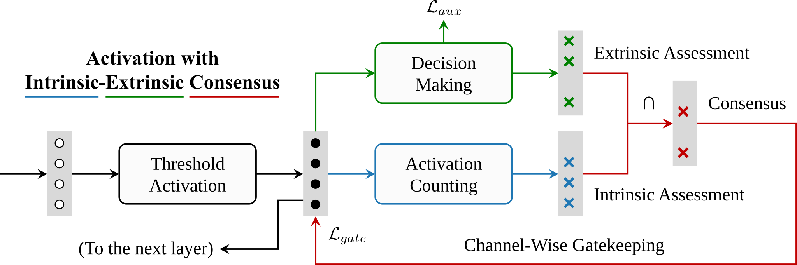

Activation with Intrinsic-Extrinsic Consensus
========

[](https://icml.cc/Conferences/2026)
&emsp;[](https://github.com/horrible-dong/QTClassification)
&emsp;[](README.md)
&emsp;[](LICENSE)

> Authors: Tian Qiu, Zunlei Feng, Yang Gao, Bingde Hu, Yi Gao, Mingli Song  
> Affiliation: Zhejiang University  
> [[Paper]](https://openreview.net/pdf?id=vLTdrPGs3V) | [[Poster]](poster.pdf)

## Abstract

Artificial Neural Networks (ANNs) are powerful tools for complex decision-making tasks. While existing activation
mechanisms often promote sparsity through thresholding, they lack explicit awareness of feature channel relevance,
causing networks to continuously suffer from interference by noisy channels. Such irrelevant activation signals can
propagate through the network and adversely affect the final decision. Inspired by observations that channel relevance
can be reflected in both intrinsic activity levels and extrinsic decision weights, and that there is strong consensus
between these two aspects, we propose AIEC (Activation with Intrinsic-Extrinsic Consensus), a novel activation mechanism
that has the ability to identify and suppress irrelevant feature channels during training. With a basic threshold
activation, AIEC integrates an intrinsic Activation-Counting Unit that tracks channel activation statistics, an
extrinsic Decision-Making Unit that learns channel decision weights, and a Consensus Gatekeeping Unit that suppresses
irrelevant channels based on the agreement between intrinsic and extrinsic channel relevance assessments. Extensive
experiments demonstrate that AIEC can effectively suppress irrelevant channels and encourage sparser representations.
Furthermore, AIEC is compatible with a wide range of mainstream ANN architectures and achieves superior performance
compared to existing activation mechanisms across multiple tasks and domains.

<div align="center">
  
</div>

## Installation

The development environment of this project is `python 3.8 & pytorch 1.13.1+cu117`.

1. Create your conda environment.

```bash
conda create -n qtcls python==3.8 -y
```

2. Enter your conda environment.

```bash
conda activate qtcls
```

3. Install PyTorch.

```bash
pip install torch==1.13.1+cu117 torchvision==0.14.1+cu117 --extra-index-url https://download.pytorch.org/whl/cu117
```

Or you can refer to [PyTorch](https://pytorch.org/get-started/previous-versions/) to install newer or older versions.
Please note that if pytorch ≥ 1.13, then python ≥ 3.7.2 is required.

4. Install necessary dependencies.

```bash
pip install -r requirements.txt
```

## Training

Import the config file (.py) from [configs](configs).

**single-gpu**

```bash
python main.py --config /path/to/config.py
```

or

```bash
python main.py -c /path/to/config.py
```

**multi-gpu**

```bash
torchrun --nproc_per_node=$num_gpus main.py --config /path/to/config.py
```

or

```bash
torchrun --nproc_per_node=$num_gpus main.py -c /path/to/config.py
```

Currently, the `cifar10` and `cifar100` datasets will be automatically downloaded to the `--data_root` directory. Please
keep the network accessible. For other datasets, please refer to ["How to put your datasets"](data/README.md).

During training, the config file, checkpoints (.pth), logs, and other outputs will be stored in `--output_dir`.

## Evaluation

**single-gpu**

```bash
python main.py --config /path/to/config.py --resume /path/to/checkpoint.pth --eval
```

or

```bash
python main.py -c /path/to/config.py -r /path/to/checkpoint.pth --eval
```

**multi-gpu**

```bash
torchrun --nproc_per_node=$num_gpus main.py --config /path/to/config.py --resume /path/to/checkpoint.pth --eval
```

or

```bash
torchrun --nproc_per_node=$num_gpus main.py -c /path/to/config.py -r /path/to/checkpoint.pth --eval
```

## License

Our code is released under the Apache 2.0 license. Please see the [LICENSE](LICENSE) file for more information.

Copyright (c) QIU Tian and ZJU-VIPA Lab. All rights reserved.

Licensed under the Apache License, Version 2.0 (the "License"); you may not use these files except in compliance with
the License. You may obtain a copy of the License at http://www.apache.org/licenses/LICENSE-2.0.

Unless required by applicable law or agreed to in writing, software distributed under the License is distributed on an
"AS IS" BASIS, WITHOUT WARRANTIES OR CONDITIONS OF ANY KIND, either express or implied. See the License for the specific
language governing permissions and limitations under the License.

## Citation

If you find the paper useful in your research, please consider citing:

```bibtex
@inproceedings{aiec,
  title={Activation with Intrinsic-Extrinsic Consensus},
  author={Qiu, Tian and Feng, Zunlei and Gao, Yang and Hu, Bingde and Gao, Yi and Song, Mingli},
  booktitle={International Conference on Machine Learning},
  year={2026}
}
```
